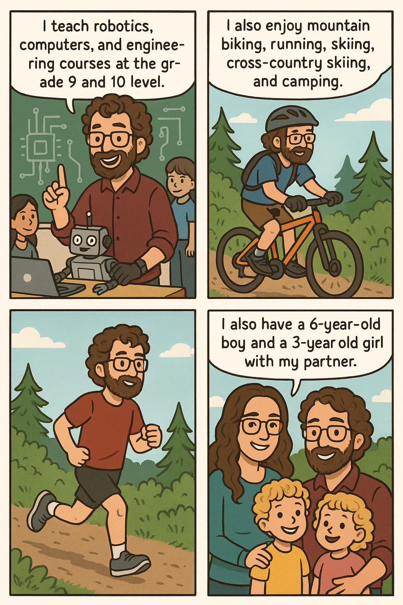

|                                                                                            |                                                                                                                                                                                                                                                                                                                                                                                                                                                                              |
| :----------------------------------------------------------------------------------------- | :--------------------------------------------------------------------------------------------------------------------------------------------------------------------------------------------------------------------------------------------------------------------------------------------------------------------------------------------------------------------------------------------------------------------------------------------------------------------------- |
|   | I'm Jon Derpak, a Teacher Librarian in training currently at Queens University. I have been teaching 9 years and have taught many subjects including: Earth Science, Geology , Math, French, Robotics, Engineering and Computer Science. I currently teach at the grade 9 and 10 level and will be teaching grade 11 next year as well as my school is transitioning to an 8 to 12 school over the next 3 years. I have 2 kids with my partner and we live in Salmon arm BC. |

___

## [[2 Module2 Role of a Teacher Librarian.png|Role of a Teacher Librarian]]
Click the title to see an infographic describing the role of a Teacher Librarian in a school.

## [[Key Resources|Key Resources]]
Click the title to see a full list of key resources useful to a Teacher Librarian

## [[3 Module3 Elevator Pitch.m4a|Elevator Pitch]]
Click the title to listen to my pitch for the development of a Library Learning Commons at my school

## Mission Statement #TODO

## LLC Vision Statement #TODO
